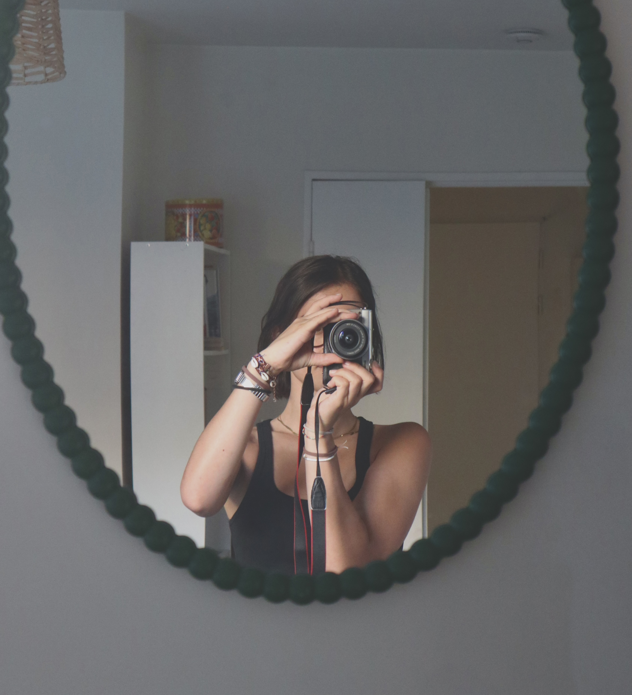

# Rosalie Millner @ ENS Paris-Saclay | Dauphine-PSL

  

---

Hi! I am currently a research intern at **Adobe**, working on geometry-aware material editing in natural images. 

I am also completing my Master 2 at **École Normale Supérieure Paris-Saclay**, specialising in Mathematics and Programming applied to Machine and Deep Learning. I have a background centered around Mathematics and Statistics. 

My research interests are now focused on Computer Vision, Computer Graphics, Image and Video processing, Generative AI, as well as Statistical Modelling. 

Outside of academics, I am passionate about film-making and video editing. 🎞️🎥

---

You can reach me on LinkedIn or on email via rosalie@millner.fr.

<!--
**rosaliemillner/rosaliemillner** is a ✨ _special_ ✨ repository because its `README.md` (this file) appears on your GitHub profile.

Here are some ideas to get you started:

- 🔭 I’m currently working on ...
- 🌱 I’m currently learning ...
- 👯 I’m looking to collaborate on ...
- 🤔 I’m looking for help with ...
- 💬 Ask me about ...
- 📫 How to reach me: ...
- 😄 Pronouns: ...
- ⚡ Fun fact: ...
-->
